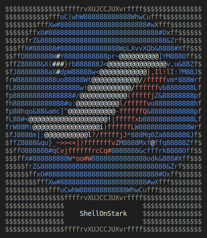
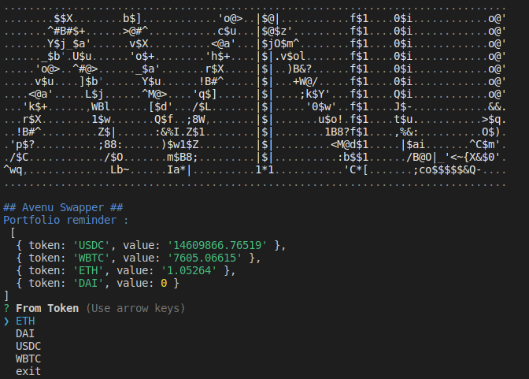
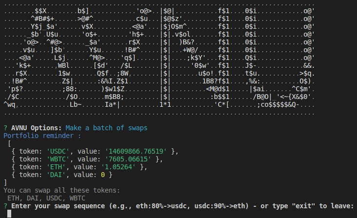
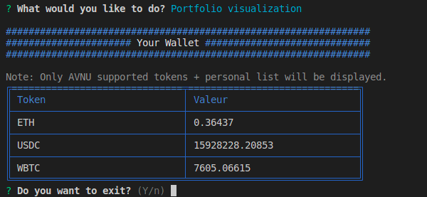

# ShellOnStark



ShellOnStark is a bot designed to facilitate the management and visualization of cryptocurrency portfolios. 

It offers features such as token swapping and portfolio visualization, making the management of your digital assets simpler and more intuitive.

## Features

* AVNU Swap: Allows easy token swapping.
* Portfolio Visualization: Add your personal tokens to view your portfolio.

## Initial Setup

### Add .env file

Copy the example file to create your configuration file:
```
cp .env.example.env
```
Update this file with your personnal values.

### Install dependencies

```
npm install
```

## Usage

### Starting the bot

To start the bot, run the following command:
```
npm run start
```

### Add custom tokens

You have the option to add additional tokens of your choice by creating and customizing the `files/personal_tokens.json` file. 

An example configuration is provided in the `files/personal_tokens.sample` file to guide you through this process.

### AVNU swap

Just follow the prompt.



### AVNU multiswap

To initiate a multiswap, users must provide their swap parameters in the following format:
```bash
[CRYPTO_SYMBOL]:[PERCENTAGE_TO_SWAP]->[TARGET_CRYPTO_SYMBOL], ...
```
eg:  `eth:80%->usdc, usdc:90%->eth`



### AVNU Swap Scheduler

#### Configuring the Scheduler

By default, the scheduler checks every 15 minutes between 01:00 and 05:00 AM UTC if the gas fees exceed $1.

To choose the right timeframe for your Ethereum transactions, you can refer to the heatmap on Etherscan's gas tracker. 
This tool provides valuable insights to help you determine the best times for making transactions. 

Check it out here: [Etherscan Gas Tracker Heatmap](https://etherscan.io/gastracker#heatmap_gasprice)

To customize these settings:

* **Execution Schedule**: Edit the `ecosystem.config.cjs` file:
```javascript
cron_restart: '0 */15 01-05 * * *'
```

* **Maximum Gas Fees**: Update the config.js file:
```javascript
max_gas_fees_in_usd: 1 // 1$
```

#### Launch the scheduler

1. **Install PM2** (if not already installed):

```bash
npm install pm2 -g
```
2. Create a Logs Directory:

```bash
mkdir logs
```

3. **Start the Application with PM2:**

```bash
pm2 start ecosystem.config.js
```
 4. **Save PM2 Configuration:**

```bash
pm2 save
```
5. **Set Up PM2 Startup Script** (to ensure your processes are restarted after a reboot).
```bash
pm2 startup
```
**Important Note**

When setting up the PM2 startup script, PM2 will provide you with a command after executing `pm2 startup`. **Do not forget to run this command**. 

It's essential for ensuring that your processes are restarted after a system reboot.

#### Add a Swap Schedule

Run the following command to start the main bot:

```bash
npm run start
```
Navigate to Avnu menu -> Schedule a Swap and follow the prompts.

The main bot creates a file named `files/scheduled_swap.json` which contains the scheduled swaps.

The created scheduler will process swaps added to `files/scheduled_swap.json` and log execution reports in `files/executed_swap.json`.

For more information, check the logs in the `./logs` directory.

#### Monitoring and Logs:

* Use `pm2 monit` to monitor processes.
* Use `pm2 logs` for real-time logs.

#### Remove the scheduler

To stop the scheduled execution and remove the PM2 startup configuration:

1. **Disable PM2 Startup Script**: 
   To prevent the application from automatically starting on system boot, run:
   ```bash
   pm2 unstartup systemd
   ```
2. **Stop the scheduler**: 
   If your application is currently running and managed by PM2 (e.g., gas-optimizer), you can stop it using:
   ```bash
   pm2 stop gas-optimizer
   ```

### Portfolio visualization

Access the bot menu and select 'Portfolio Visualization' to see your assets.



## Your Feedback Matters!

We are always open to suggestions and ideas from our community. 

If you have a feature idea that you would like to see in ShellOnStark, please feel free to contact us or contribute to the project.

[@SymbOnStark](https://twitter.com/SymbOnStark)

## License

This project is licensed under the MIT License. For more details, please see the [LICENSE](./LICENSE) file in this repository.