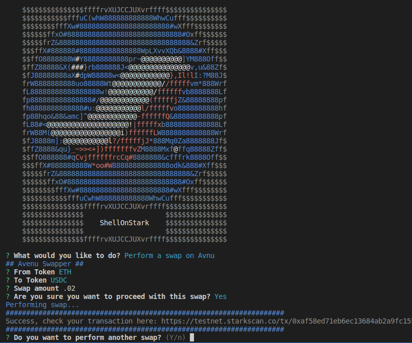

# ShellOnStark


## Add .env file

```
cp .env.example.env
```
Update this file with your values.

## Install dependencies

```
npm install
```

## Run the bot

```
npm run start
```
## Initiate a swap

Just follow the prompt.

